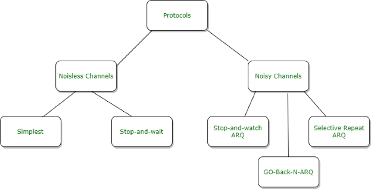
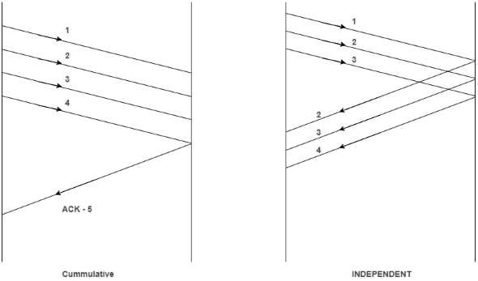
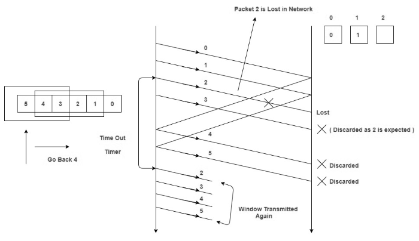
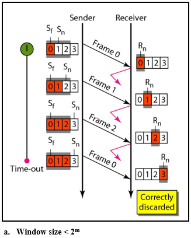
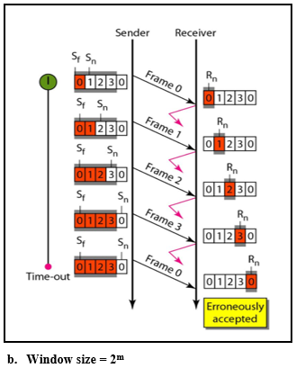
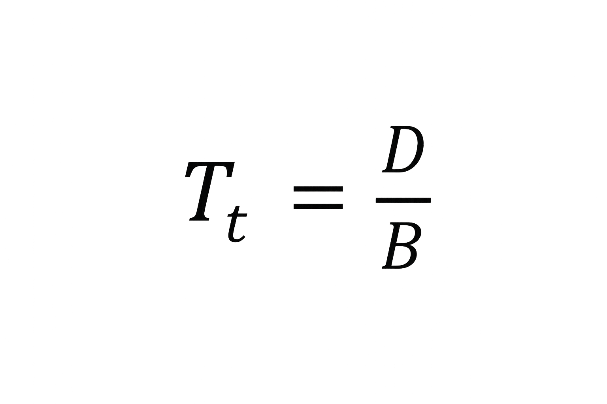
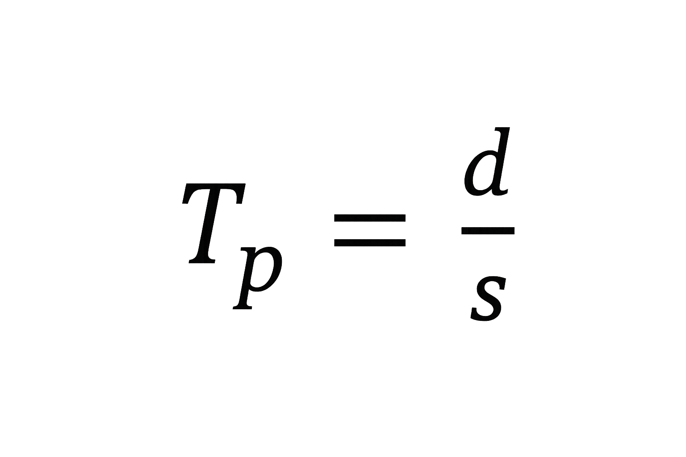
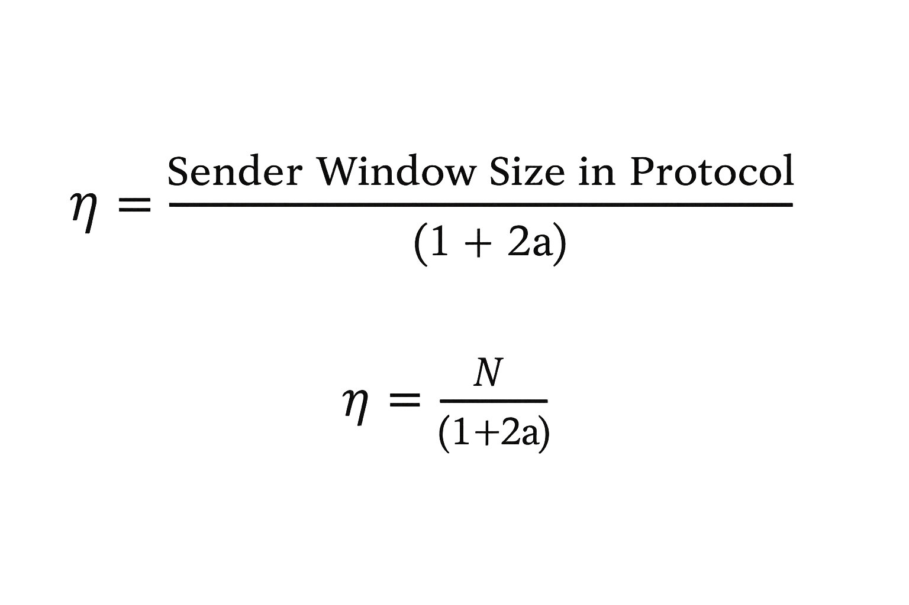
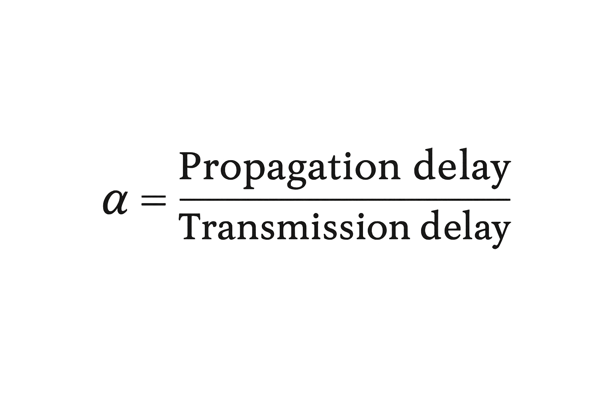

### Introduction

Flow Control is a set of procedures for the Data Link Layer that controls the flow of data between the sender and the receiver. It allows two stations working at different speeds to communicate with each other. It is a set of measures taken to regulate the data that the Sender sends to receiver, so that no problem is faced if the Sender sends data at higher rate and receiver is too slow to support that data rate.  

To solve the above problem, **Flow Control** is introduced in the Data Link Layer. It tells the sender how much data should be sent to the receiver so that the data is not lost. The main concept of Flow Control is to introduce **efficiency** in Computer Networks. To help in it, there are various flow control protocols which are classified as:  

 

<figcaption><strong>Fig. 1 Flow Control Protocols</strong></figcaption>

 

The protocols in the first category cannot be used in real life, but they serve as a basis for understanding the protocols of noisy channels.  

All the protocols we will discuss are unidirectional in the sense that the data frames travel from one node, called the sender, to another node, called the receiver. Although special frames, called acknowledgment (ACK) and negative acknowledgment (NAK) can flow in the opposite direction for flow and error control purposes, data flow in only one direction.  

In a real-life network, the data link protocols are implemented as bidirectional; data flow in both directions. In these protocols the flow and error control information such as ACKs and NAKs is included in the data frames in a technique called **piggybacking**.  

Because bidirectional protocols are more complex than unidirectional ones, we chose the latter for our discussion.  

### Go Back N Protocol

It is a specific instance of the automatic repeat request (ARQ) protocol. The sender sends a specific number of frames called **Window Size**.  

### The three main characteristic features of GBN are:

1. **Sender Window Size (WS)**  
   It is N itself. If we say the protocol is GB10, then WS = 10.  
   N should always be greater than 1 in order to implement pipelining. For N = 1, it reduces to Stop and Wait protocol.

2. **Receiver Window Size (WR)**  
   WR is always 1 in GBN.  

3. **Acknowledgements**  
   There are 2 kinds of acknowledgements:  
   - **Cumulative ACK**: One acknowledgement is used for many packets. Advantage: less traffic. Disadvantage: less reliability, as if one ACK is lost, all packets appear lost.  
   - **Independent ACK**: Every packet gets an acknowledgement independently. Advantage: high reliability. Disadvantage: high traffic.

 
<figcaption><strong>Fig. 2 Types of acknowledgements</strong> </figcaption>

### Working of Go-Back-N ARQ

This protocol involves the following transitions:  

- A sender sends multiple frames as allowed by the window size.  
- Receiver sends ACK for every valid frame received.  
- Once the sender receives the acknowledgement of one frame, the next frame in the queue is sent.  
- If the ACK does not reach the sender before a certain time (timeout), then **all the frames in the current window are retransmitted**.  

Consider the diagram (fig. 3) given below. We have sender window size of 4. Assume that we have lots of sequence numbers just for the sake of explanation. 
Now the sender has sent the packets 0, 1, 2 and 3. After acknowledging packets 0 and 1, the receiver is now expecting packet 2, and the sender window has also slid to further transmit packets 4 and 5.
 Now suppose the packet 2 is lost in the network, 
Receiver will discard all the packets which sender has transmitted after packet 2 as it is expecting sequence number of 2. 
On the sender side for every packet send there is a time out timer which will expire for packet number 2. 
Now from the last transmitted packet 5 sender will go back to the packet number 2 in the current window and transmit all the packets till packet number 5. 
That’s why it is called Go Back N. Go back means sender has to go back N places from the last transmitted packet in the unacknowledged window and not from the point where the packet is lost.

<figcaption><strong>Fig. 3 Working of Go-Back-N ARQ</strong> </figcaption>

### Sequence Numbers
  
In the Go-Back-N Protocol, the sequence numbers are modulo 2m, where m is the size of the sequence number field in bits. 
**For example,** if m is 4, the only sequence numbers are 0 through 15 inclusive. However, we can repeat the sequence. So the sequence numbers are 0, 1, 2, 3, 4, 5, 6, 7, 8, 9, 10, 11, 12, 13, 14, 15, 0, 1, 2, 3, 4, 5, 6, 7, 8, 9, 10, 11, ... 
 
In Go-Back-N ARQ, the size of the send window must be less than 2m; the size of the receiver window is always 1. 

### Why window size &lt; 2m ?

Example: m = 2 → max window size = 2^m – 1 = 3  

- If window size = 3 and ACKs are lost → timeout → retransmission → receiver discards duplicates correctly.  
- If window size = 4 and ACKs are lost → duplicate confusion occurs, leading to errors.  

Notation:  
- **Sf** = send window, first outstanding frame  
- **Sn** = send window, next frame to be sent  
- **Rn** = receiver’s expected frame  

  
<figcaption><strong>Fig. 4 Window size for GBN</strong> </figcaption>

 

### **Few Terminologies:**

**1. Transmission Delay (Tt)**: Time to transmit the packet from host to the outgoing link.

Where,  
- **D**: Data Size to transmit
- **B**: Bandwidth of the link
 

**2. Propagation Delay (Tp)** : It is the time taken by the first bit transferred by the host onto the outgoing link to reach the destination. 

where
- **d** : distance,</li>
- **s** : the wave propagation speed (depends on the characteristics of the medium).
   
**3. Efficiency of GBN (η)**

 
where,     

  

### Advantages

- It can send multiple frames at once.
- Pipelining is present in the Go-Back-N ARQ i.e. a frame can be sent by the sender before receiving the acknowledgment of the previously sent frame. This results in a lesser waiting time for the frame.

### Disadvantages

- If acknowledgment for a frame is not received, the whole window of frames is retransmitted instead of just the corrupted frame. This makes the Go Back N ARQ protocol inefficient. 
- Retransmission of all the frames on detecting a corrupted frame increases channel congestion and also increases the bandwidth requirement.
- It is more time-consuming because while retransmitting the frames on detecting a corrupted frame, the error-free frames are also transmitted.
 